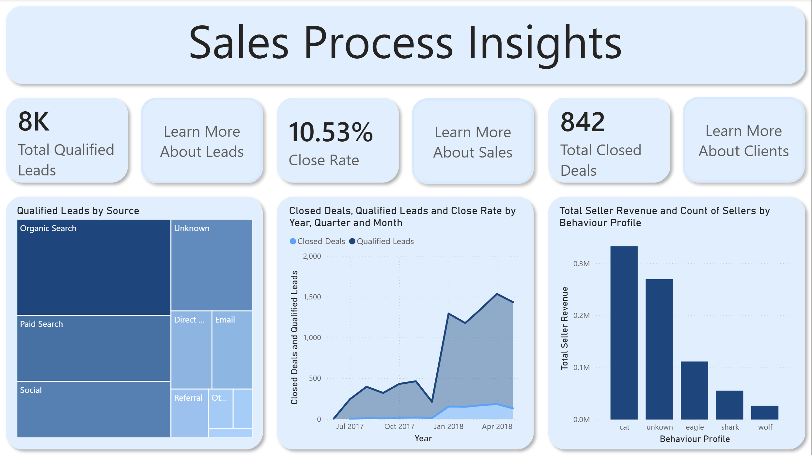
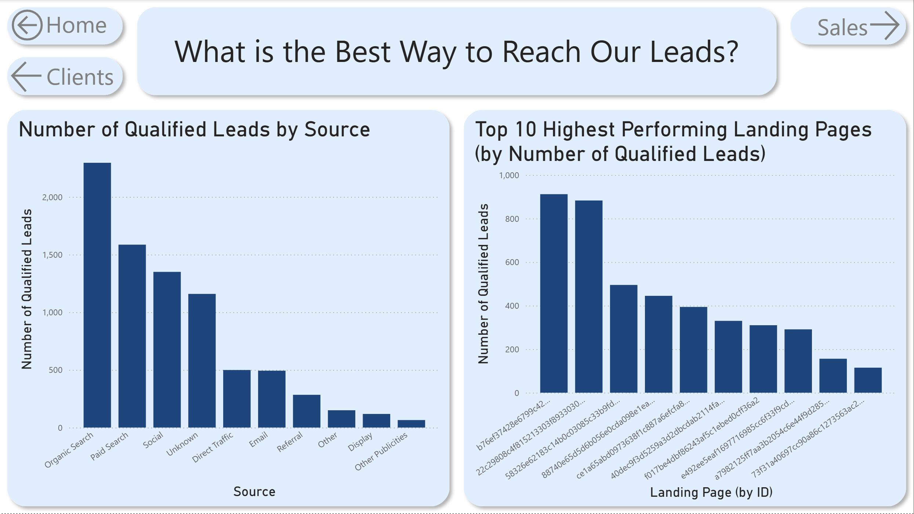
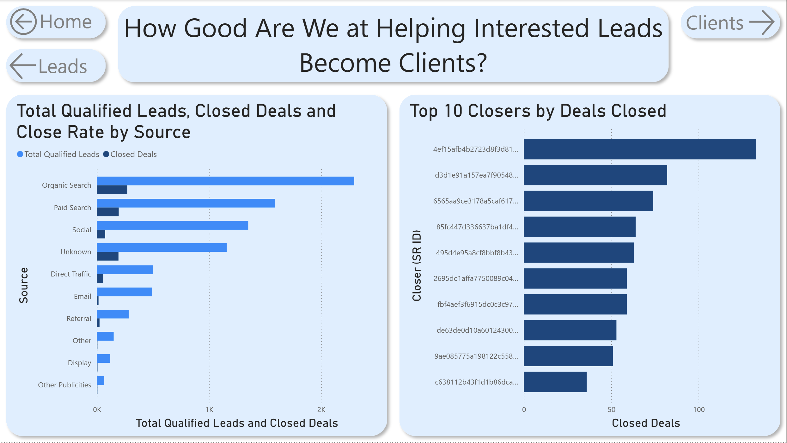
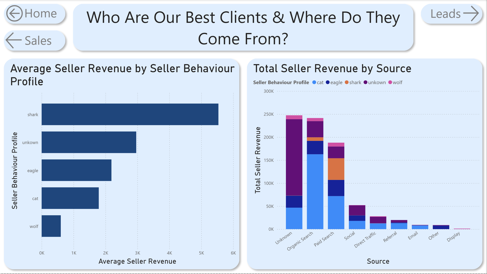

**Dashboard for Sales & Customer Analysis**
===============================


**Objective**
-------------

This dashboard was built to help marketing and sales teams track performance across their teams, understand client behavior, and identify which types of clients generate the most value.

It answers the questions:

- Who are our best clients and where are they coming from?
- How good are we at closing those leads?
- How are we acquiring those leads?

**Key Insights**
----------------
- Sellers with the 'Shark' behaviour profile have the highest average revenue but contribute relatively little to the total revenue.
- Sellers with the 'Cat' behaviour profile make up the highest percentage of sellers and contribute the most to revenue.
- Organic and paid search generate the highest volume of leads out of all sources. They both have above average close rates.
- We close leads from the 'Unknown' source at the highest rate (16.65%). Investigating what 'Unknown' means could be an important step to finding the most effective marketing channel(s).

**Data Overview**
-----------------
Two datasets were used in this project:

- [Marketing Funnel by Olist](https://www.kaggle.com/datasets/olistbr/marketing-funnel-olist?select=olist_closed_deals_dataset.csv)
- [Brazilian E-Commerce Public Dataset by Olist](https://www.kaggle.com/datasets/olistbr/brazilian-ecommerce)

Most of the data comes from the marketing funnel dataset, while revenue-related data comes from the e-commerce dataset.

### Data Quality
----------------
The leads data is incomplete, as it only includes qualified leads and closed deals. This makes it impossible to analyze earlier stages of the funnel, such as total leads, appointment rates, or website traffic.

As a result, certain performance metrics—such as true close rates per sales representative—cannot be fully evaluated, since the total number of sales interactions is unknown.

### Calculated Tables, Columns, & Measures
------------------------------------------
- A date table was created but ultimately not used, as the existing date fields were sufficient.

- A table called seller_behaviour_profile was derived from olist_closed_deals. This transformation splits the behavior profile column so that each profile appears in its own row, with seller_id repeated as needed.

- Zip code prefixes were standardized across all tables (fixing missing leading zeros), though no geographic analysis was included in the final dashboard.

- A **Close Rate** measure was created for use in visuals and tooltips:

```DAX
Close Rate = 
    DIVIDE(
        DISTINCTCOUNT(olist_closed_deals[seller_id]),
        DISTINCTCOUNT(olist_marketing_qualified_leads[mql_id])
    )
```
This represents the proportion of qualified leads that resulted in closed deals.

- Two additional measures were created for revenue analysis:
```DAX
Total Seller Revenue = 
SUMX(
  VALUES(olist_order_items[seller_id]),
  CALCULATE(SUM(olist_order_payments[payment_value]))
)
```
This calculates total revenue generated by each seller.

```DAX
Average Seller Revenue = 
AVERAGEX(
  VALUES(olist_order_items[seller_id]),
  CALCULATE(SUM(olist_order_payments[payment_value]))
)
```

This calculates the average revenue per seller within the current context.

All measures were organized in a dedicated **_Measures** table.

**Home Page**
-------------


**Lead Analysis Page**
----------------------


**Sales Analysis Page**
-------------


**Client Analysis Page**
------------------------
